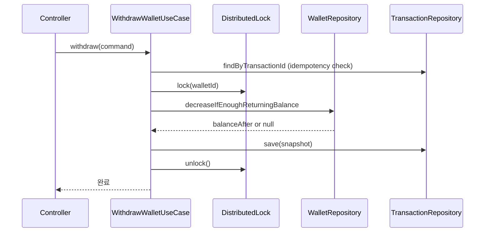

# Wallet Withdrawal API

동일 월렛에 동시 출금 요청이 발생해도 잔액 무결성을 유지하는 출금·거래내역 API입니다.

분산락(Redis)과 단일 SQL 조건 기반 차감을 함께 사용하며, 멱등성(transactionId 기반)을 지원합니다.

---

## 목차

1. [기술 스택 및 환경](#1-기술-스택-및-환경)
2. [패키지 구조](#2-패키지-구조)
3. [실행 방법](#3-실행-방법)
4. [API](#4-api)
5. [보안](#5-보안)
6. [에러 코드](#6-에러-코드)
7. [분산락(Redis)](#7-분산락redis)
8. [동시성 테스트 결과](#8-동시성-테스트-결과)
9. [부하테스트 (k6, Before/After)](#9-부하테스트-k6-beforeafter)
10. [테스트](#10-테스트)

---

## 1. 기술 스택 및 환경

| 구분 | 기술 |
|------|------|
| 언어 | Kotlin |
| 프레임워크 | Spring Boot 3+, Spring Data JPA |
| DB | PostgreSQL 16 (Flyway 마이그레이션) |
| 인프라 | Redis 7 (분산락), Docker Compose 로컬 구성 |

---

## 2. 패키지 구조

```
com.example.wallet
├── application          # 유스케이스 (출금, 거래내역 조회)
│   ├── WithdrawWalletUseCase
│   ├── GetWalletTransactionsUseCase
│   └── command/
├── presentation         # API 계층 (Controller, DTO)
│   ├── WalletController
│   └── dto/
├── domain               # 도메인 (Wallet, Transaction, Repository 인터페이스)
│   ├── wallet/
│   └── transaction/
├── infrastructure       # 외부 연동 (Redis 분산락 등)
│   └── lock/
└── common               # 공통 (인증, API 래퍼, 에러 처리)
    ├── auth/
    ├── api/
    ├── error/
    └── exception/
```

---

## 3. 실행 방법

### 3.1 인프라 (Docker Compose)

프로젝트 루트에서

```bash
docker compose up -d
```

- Postgres : `localhost:5432`, DB명 `wallet`, 사용자/비밀번호 `wallet`
- Redis : `localhost:6379`

### 3.2 DB 세팅

- DDL은 **Flyway**로 적용됩니다. (`src/main/resources/db/migration/`)
- 애플리케이션 기동 시 자동으로 마이그레이션이 실행됩니다.
- `ddl-auto: validate` 이므로 스키마는 Flyway 전용입니다.

### 3.3 테스트용 초기 데이터

- Flyway V2 마이그레이션(`V2__seed_data.sql`)에서 다음을 INSERT 합니다.
  - 사용자 1 : 지갑 2개 (잔액 100,000 / 200,000)
  - 사용자 2 : 지갑 1개 (잔액 50,000)
- 기동 후 별도 삽입 없이 위 지갑으로 출금·조회를 확인합니다.

### 3.4 API 서버 실행

```bash
./gradlew bootRun
```

- 기본 포트 : **8080**
- Postgres·Redis가 `localhost:5432`, `localhost:6379`에서 동작 중이어야 합니다.

---

## 4. API

### 4.1 출금 API

#### POST /api/wallets/{walletId}/withdraw

**요청 헤더**

| Header  | 필수 | 설명 |
|---------|------|------|
| User-Id | O    | 출금 요청 사용자 ID (지갑 소유자와 일치해야 함) |

**요청 Body**

```json
{
  "transaction_id": "TXN_UUID_12345",
  "amount": 10000
}
```

| 필드 | 타입 | 필수 | 설명 |
|------|------|------|------|
| transaction_id | String | O | 멱등성 보장을 위한 고유 ID |
| amount | Long | O | 출금 금액 (0 초과) |

**성공 응답 (200)**

```json
{
  "success": true,
  "data": null
}
```

(현재 구현은 공통 래퍼만 반환하며, 잔액은 거래내역 조회로 확인합니다.)

**실패 응답 예시**

```json
{
  "success": false,
  "data": null,
  "error": {
    "code": "INSUFFICIENT_BALANCE",
    "message": "Insufficient balance",
    "timestamp": "2025-02-19T10:00:00"
  }
}
```

---

### 4.2 거래내역 조회 API

#### GET /api/wallets/{walletId}/transactions

**요청 헤더**

| Header  | 필수 | 설명 |
|---------|------|------|
| User-Id | O    | 조회 요청 사용자 ID (지갑 소유자와 일치해야 함) |

**쿼리 파라미터**

| 파라미터 | 타입 | 기본값 | 설명 |
|----------|------|--------|------|
| page | Int | 0 | 페이지 번호 |
| size | Int | 20 | 페이지 크기 |

**성공 응답 (200) 예시**

```json
{
  "success": true,
  "data": {
    "transactions": [
      {
        "transaction_id": "TXN_001",
        "wallet_id": 1,
        "withdrawal_amount": 10000,
        "balance": 90000,
        "withdrawal_date": "2025-02-19T10:00:00"
      }
    ]
  }
}
```

---

### 출금 흐름



---

## 5. 보안

- Gateway에서 인증이 완료된 요청이 전달된다고 가정합니다.
- **User-Id** 헤더로 사용자를 식별하며, `@Authenticated`가 붙은 API는 해당 헤더가 필수입니다.
- User-Id 누락 시 HTTP `401` (Unauthorized), 형식 오류 시 HTTP `400` (Bad Request)을 반환합니다. Body로 사용자 ID를 보내는 방식은 허용하지 않습니다.
- actuator 경로는 excludePathPatterns로 인증을 제외합니다.

---

## 6. 에러 코드

| ErrorCode | HTTP Status | 설명 |
|-----------|-------------|------|
| INVALID_REQUEST | 400 | 잘못된 요청 |
| INVALID_USER_ID | 400 | User-Id 형식 오류 |
| AUTH_REQUIRED | 401 | 인증 필요 (User-Id 누락) |
| UNAUTHORIZED | 403 | 지갑 소유자가 아님 |
| INSUFFICIENT_BALANCE | 400 | 잔액 부족 |
| WALLET_BUSY | 409 | 지갑 사용 중 (락 경합) |
| INTERNAL_ERROR | 500 | 내부 오류 |

> 클라이언트는 응답 body의 `error.code` 값을 기준으로 분기 처리합니다.

---


## 7. 분산락(Redis)

### 7.1 기본 정합성 보장 방식

잔액 차감은 `balance >= amount` 조건을 포함한 **단일 SQL 조건 기반 차감**으로 수행합니다. 조회·검사·저장을 분리하지 않고 하나의 UPDATE 문으로 처리하여 잔액 음수를 방지하므로, 잔액 무결성은 DB 레벨에서 1차적으로 보장됩니다.

```sql
UPDATE wallets
SET balance = balance - :amount
WHERE id = :walletId
  AND balance >= :amount
RETURNING balance;
```

> 조건을 만족하는 경우에만 잔액을 차감하고, 성공 시 변경된 balance를 반환합니다. 지갑 소유자 검증(owner_user_id)은 UseCase `authorize()`에서 별도로 처리합니다.

---

### 7.2 설계 결정

#### 7.2.1 선택 이유 (다른 기법과 비교)

- **단일 SQL 조건 기반 차감** : `balance >= amount` 조건을 포함한 UPDATE 1회로 처리합니다. 조회-검사-저장을 분리하지 않아 동시성 충돌을 줄입니다. 현 요구사항 범위(단순 차감)에서는 재시도·보상 로직을 최소화할 수 있어 이 방식을 적용했습니다.
- **분산락 (Redis)** : 동일 walletId 요청을 애플리케이션 레벨에서 직렬화해 DB row-level 경합을 줄입니다. 비관적 락(`SELECT ... FOR UPDATE`)은 connection 유지 시간이 길어집니다. 멀티 인스턴스 환경에서도 DB row-level lock은 정상 동작합니다. 다만 동일 walletId 요청이 몰릴 경우 경합이 DB 커넥션 대기로 집중될 수 있어, 애플리케이션 레벨에서 walletId 단위로 선제 직렬화하는 방식을 선택했습니다.
- **멱등성 (transactionId)** : 동일 요청 재전송 시 중복 출금을 막기 위해 transaction_id UNIQUE 제약과 선조회로 처리합니다. 별도 이벤트 소싱이나 별도 멱등 테이블 없이 기존 스키마로 처리했습니다.

> 분산락은 정합성의 필수 요건이라기보다, **경합 완화와 지연 안정화를 위한 선택**입니다. 정합성은 단일 SQL 조건 기반 차감으로 먼저 유지합니다.

#### 7.2.2 성능·안정성 트레이드오프

**정합성 근거 (부하테스트)**

| 항목 | 기대값 | main | feature/no-concurrency-control | 의미 |
|------|--------|------|------------------------|------|
| Scenario A 반영 건수 | 600 | 600 | 592 | 경합으로 일부 요청이 반영되지 않음 |
| Scenario B 반영 건수 | 1 | 1 | 1 | UNIQUE 제약으로 1건 유지 |
| 전체 transactions | 601 | 601 | 592 | Scenario A 누락 발생 |
| 최종 잔액 | 3,990,000 | 3,990,000 | 4,080,000 | 누락 9건 × 10,000 차이 |

> 제어 적용 시 기대값과 일치하며, 미적용 시 경합으로 일부 요청이 반영되지 않았습니다.

**성능·가용성**

- **성능** : 락 획득/해제에 Redis 네트워크 왕복이 추가됩니다. 동일 지갑 요청 몰림 시 DB 경합이 줄어 tail latency(p95, p99) 안정화를 기대합니다. 수치는 [9장 k6 수치](#k6-수치-참고) 참고.
- **가용성** : Redis 장애 시 락 획득 실패로 WALLET_BUSY(409)가 발생할 수 있어 Redis 가용성에 의존합니다.

#### 7.2.3 우려사항

- **Redis 의존성** : Redis 장애 시 락을 잡지 못해 출금이 실패하거나, fallback 없이 장애가 전파될 수 있습니다.
- **락 대기** : 같은 walletId로 요청이 몰리면 한 번에 한 요청만 처리되어 대기 시간이 늘어나고, leaseTime 내 해제 실패 시 다음 요청까지 블로킹될 수 있습니다.
- **네트워크 비용** : 매 요청마다 Redis lock/unlock 호출이 들어가 네트워크 지연과 Redis 부하가 증가합니다.
- **운영 부담** : Redisson, leaseTime, key 정책 등을 관리해야 하며, 잘못된 설정은 데드락·락 미해제로 이어질 수 있습니다.

#### 7.2.4 향후 대책

- **Redis 고가용성** : Redis Cluster 또는 Sentinel로 장애 시 failover가 되도록 구성하고, 락 저장소 이중화를 검토합니다.
- **락 대기 제한** : lock wait timeout을 두어 무한 대기를 막고, WALLET_BUSY 시 클라이언트가 재시도할 수 있도록 API·문서를 정리합니다.
- **모니터링** : 락 대기 시간, Redis 장애, WALLET_BUSY 발생률을 지표로 수집해 이상 시 알림을 받도록 합니다.
- **복합 로직 시 비관적 락 검토** : 향후 잔액·거래내역을 함께 조회·계산하는 복합 로직이 생기면 `SELECT ... FOR UPDATE` 등 DB 비관적 락 도입을 검토합니다. 현 요구사항 범위에서는 분산락 + 단일 SQL 조건 기반 차감 조합을 적용했습니다.

---

### 7.3 용어 설명

**단일 SQL 조건 기반 차감**이란,

`balance >= amount` 조건을 포함한 하나의 UPDATE 문으로 잔액을 차감하는 방식입니다.  
조회-검사-저장을 분리하지 않기 때문에 동시성 충돌을 줄입니다.

---

## 8. 동시성 테스트 결과

```text
※ 현재 브랜치는 분산락이 적용된 상태입니다.
"적용 전"은 feature/no-concurrency-control 브랜치 기준과 비교하는 것입니다.
```

### 실행 방법

```bash
./gradlew test
```

### 적용 전 (feature/no-concurrency-control 브랜치 기준)

| 항목 | 내용 |
|------|------|
| 테스트 클래스 | `WithdrawWalletUseCaseConcurrencyBeforeTest` |
| 설명 | 분산락·단일 SQL 조건 기반 차감 없이 동시 출금 시 정합성 위반(잔액 불일치, 총 출금 초과)이 발생할 수 있음을 재현 |

예시 로그

```
Before: trialCount=50, violationObserved=true, sampleFinalBalance=30000
Before 위반 유형: 잔액불일치, 총출금초과
```

### 적용 후 (현재 브랜치)

| 항목 | 내용 |
|------|------|
| 테스트 클래스 | `WithdrawWalletUseCaseConcurrencyAfterTest` |
| 설명 | 분산락 + 단일 SQL 조건 기반 차감으로 동시 출금 시에도 정합성 유지 |

예시 로그

```
After(같은 txId): threadCount=20, finalBalance=8000
After(다른 txId): threadCount=20, successCount=5, failureCount=15, finalBalance=0
```

### 테스트 리포트 위치

`build/reports/tests/test/index.html`

---

## 9. 부하테스트 (k6, 전후 비교)

부하테스트는 성능·동시성·멱등성 제어가 의도대로 동작하는지 확인하기 위해 진행합니다. `main` 브랜치와 `feature/no-concurrency-control` 브랜치를 `git checkout`으로 바꿔가며 동일 k6 스크립트로 실행합니다.

`feature/no-concurrency-control` 브랜치는 분산락·애플리케이션 멱등 복구 로직을 제거한 버전이며, DB 스키마의 `transaction_id` UNIQUE 제약은 유지됩니다. 따라서 Scenario B에서도 동일 txId 중복 INSERT는 DB에서 막혀 1건만 저장됩니다.

### 실행 순서

1. `docker compose up -d`
2. **동시성·멱등성 제어 미적용** : `git checkout feature/no-concurrency-control` → `./gradlew bootRun` (별도 터미널) → k6 실행.
3. **동시성·멱등성 제어 적용** : `git checkout main` → 애플리케이션 재시작 → 동일 k6 명령 실행.

k6 실행 예시

```bash
BASE_URL=http://localhost:8080 WALLET_ID=1 OWNER_USER_ID=1 k6 run loadtest/k6/withdraw.js
```

스크립트 설정·시나리오는 [loadtest/README.md](loadtest/README.md) 참고.

---

### 기대값

부하테스트는 Scenario A(0~30초) + Scenario B(35~65초)로 구성됩니다.

| 구분 | 요청 수 | transactionId | 기대 transactions 건수 |
|------|---------|---------------|------------------------|
| Scenario A (핫키) | 600회 | 매 요청마다 상이 (UUID) | 600건 |
| Scenario B (멱등) | 600회 | 동일 (idempotency-*) | 1건 |
| **합계** | 1,200회 | — | **601건** |

지갑 1 초기 잔액 10,000,000 − (601 × 10,000) = **3,990,000** 이 기대 최종 잔액입니다.

---

### `main` (동시성·멱등성 제어 적용) 실제 데이터

분산락 + 단일 SQL 조건 기반 차감 + transactionId 멱등성이 모두 적용된 상태입니다.

`wallet` 테이블 최종 상태

| id | owner_user_id | balance   |
|----|---------------|-----------|
| 1  | 1             | 3,990,000 |

`transactions` Scenario A 샘플 (서로 다른 transaction_id, balance_after가 1건씩 10,000씩 감소)

| id  | transaction_id   | wallet_id | amount | balance_after |
|-----|------------------|-----------|--------|---------------|
| 1   | b48d2651-6176-... | 1 | 10,000 | 9,990,000 |
| 2   | fcb30e97-6383-... | 1 | 10,000 | 9,980,000 |
| 3   | 84beb979-49b7-... | 1 | 10,000 | 9,970,000 |
| ... | (600건 모두 상이) |   |        |             |

`transactions` Scenario B (동일 transaction_id 600회 요청 → **1건만** 저장)

| id  | transaction_id           | wallet_id | amount | balance_after |
|-----|--------------------------|-----------|--------|---------------|
| 600 | idempotency-1771640216668 | 1         | 10,000 | 4,000,000     |

**설명** : 분산락으로 동일 지갑 요청이 직렬화되어, Scenario A 600건이 모두 반영되고 balance_after가 순차적으로 감소합니다. Scenario B는 transactionId 멱등 처리로 600회 요청이 1건만 저장됩니다. 결과적으로 transactions 601건, 잔액 3,990,000으로 기대값과 일치합니다.

---

### `feature/no-concurrency-control` (동시성·멱등성 제어 미적용) 실제 데이터

분산락·멱등 처리를 하지 않고, DB 기본 기능만으로 동작하는 상태입니다.

`wallet` 테이블 최종 상태

| id | owner_user_id | balance   |
|----|---------------|-----------|
| 1  | 1             | 4,080,000 |

`transactions` Scenario A 샘플 (동시 요청으로 balance_after 중복 발생)

| id  | transaction_id   | wallet_id | amount | balance_after |
|-----|------------------|-----------|--------|---------------|
| 1   | 3f3f4458-8ecf-... | 1 | 10,000 | 9,990,000 |
| 2   | cc9c2f81-c772-... | 1 | 10,000 | 9,990,000 |
| 3   | 792ece9a-88fa-... | 1 | 10,000 | 9,990,000 |
| ... | ...              |   |        | 9,990,000 (상위 10건 동일) |
| 11  | 2384b5d5-0d49-... | 1 | 10,000 | 9,980,000 |
| 12  | dd498264-813d-... | 1 | 10,000 | 9,970,000 |
| ... | (총 592건)       |   |        |             |

**설명** : 동시 요청 처리 과정에서 일부 트랜잭션 반영이 누락되었으며, 동일한 balance_after 값이 여러 건 기록되었습니다. 세부 원인은 8장 테스트 코드 및 해당 브랜치 구현을 참고합니다.

---

### 비교 요약

| 항목 | 기대값 | `main` (동시성·멱등 제어 O) | `feature/no-concurrency-control` (동시성·멱등 제어 X) |
|------|--------|---------------|----------------------------------|
| transactions 건수 | 601 | 601 (일치) | 592 (9건 부족) |
| 지갑 1 최종 잔액 | 3,990,000 | 3,990,000 (일치) | 4,080,000 (90,000 초과) |
| Scenario B 멱등 | 1건 | 1건 (idempotency-* 1건) | 1건 |
| balance_after 순차성 | 감소만 | 정상 | 상위 구간에 동일 값 반복 |

`main`에서는 기대값과 일치하고, `feature/no-concurrency-control`에서는 경합으로 9건 누락·잔액 90,000 초과가 발생했습니다. 분산락과 멱등 처리로 `main`에서 동시성·멱등성이 의도대로 동작함을 확인했습니다.

---

### k6 수치 (참고)

| 항목 | `feature/no-concurrency-control` | `main` |
|------|------------------------|------|
| iterations | 1,199 | 1,200 |
| http_req_failed | 0% | 0% |
| http_req_duration p95 | 18.75ms | 22.75ms |

### 응답 시간 지표 설명

| 지표 | 의미 |
|------|------|
| p50 | 전체 요청 중 50%가 이 시간 이하 |
| p95 | 상위 5%를 제외한 대부분 요청의 최대 응답 시간 |
| p99 | 거의 최악에 가까운 지연 구간 |

> p95/p99는 느린 요청 구간의 응답 시간을 의미합니다.

---

## 10. 테스트

- 단위·통합 테스트 : `./gradlew test`
- 통합 테스트는 **Testcontainers**(Postgres, Redis)를 사용합니다. CI에서는 재사용 OFF, 로컬에서는 `.testcontainers.properties`에 `testcontainers.reuse.enable=true` 로 재사용합니다.
